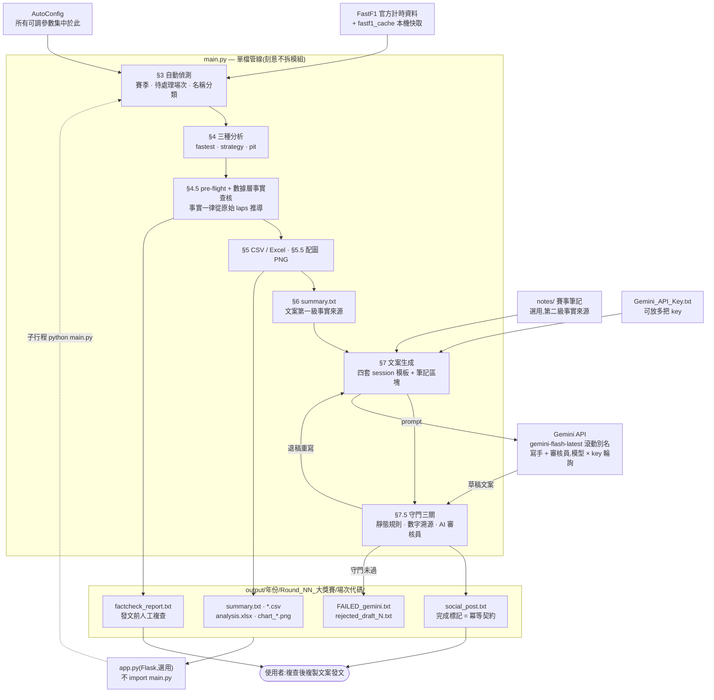
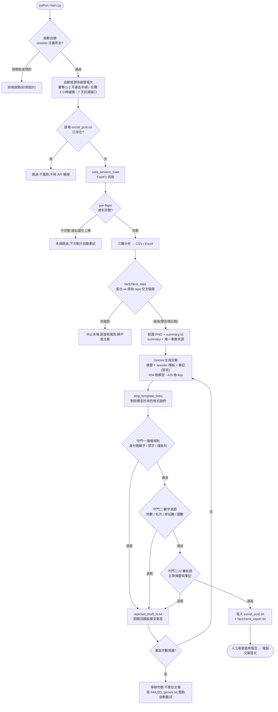

# F1_Race_Analysis

F1 賽後自動分析 + FB/IG 社群文案生成器(萬用賽季版)。

每場排位賽 / 正賽 / 衝刺賽結束後執行,自動產出:分析數據(CSV/Excel)、
文字摘要、發文配圖(PNG)、以及經過三重守門與事實查核的 FB + IG 文案。

## 快速開始

```bash
pip install -r requirements.txt
# 把 Gemini API key 貼進 Gemini_API_Key.txt(多把 key 用換行分隔)
python main.py
```

預設為自動模式:自動偵測目前賽季、找出「最近完賽但未處理」的場次。
建議掛上排程器於比賽日每 2 小時執行(冪等設計,重複執行不浪費 API 額度)。

## 系統架構



資料只往一個方向流:**原始資料 → summary.txt → 文案**。文案裡的每個數字都必須
能溯源回 summary(或賽事筆記),這條線是整個系統的核心約束。

## 執行流程



每一條「跳過 / 中止」的分支都不會留下 `social_post.txt`,所以重複執行永遠安全:
資料還沒上齊、額度用盡、守門退稿,下次跑就自動重試。

## 網頁介面(選用)

```bash
python app.py
```

開啟 http://127.0.0.1:5000(僅本機):瀏覽所有場次產出、
FB/IG 文案一鍵複製、檢視配圖與事實查核報告、一鍵觸發執行並看即時 log。

## 賽事筆記(選用)

summary 只有數據,沒有事故/天氣/罰時等敘事。想讓文案提到這些,
在專案根目錄建 `notes/{年份}_round{站次兩位數}_{場次代碼}.txt`,
例如英國站正賽:`notes/2026_round09_R.txt`(場次代碼:Q / R / SQ / S)。

```
VER 於 Stowe 彎撞車,引發末段安全車。
比賽最後在安全車下結束。
Antonelli 因前輪擋板故障失速。
Antonelli 賽後被加罰 5 秒。
Leclerc 拿下銀石首勝。
```

適合寫:事故與退賽原因、天氣、安全車/紅旗時機、罰時、你自己的觀點。

**寫作指引:一行一個事實**。避免用「並」「因此」或逗號在同一行串接多件事;
想表達因果就明確寫出(「A 導致 B」),沒寫因果的並列事實,AI 會被禁止自行連成因果。

反例(一行塞兩件事,AI 會焊成因果):

```
Antonelli 因前輪擋板故障失速,賽後被加罰 5 秒。
→ 文案寫成「因前輪擋板故障失速被加罰 5 秒」(把故障當成罰時的原因,筆記並沒有這麼說)
```

規則(系統會強制執行):

- 筆記是**第二級事實來源**:與數據摘要矛盾時,一律以摘要為準。
- AI 只會引用筆記寫明的事實,不會延伸推論;筆記裡的指令性文字會被忽略。
- 上限 2000 字元,超過會截斷並在查核報告標注。
- 筆記全文會引錄在 `factcheck_report.txt` 的 [5] 區段,發文前可核對。

**改筆記後想重生文案**:刪除該場的 `social_post.txt` 再跑一次,
或以 `force_rerun=True` 執行(已產出的場次預設會跳過,這是冪等設計)。

## 測試

```bash
python tests/smoke_test.py    # 單元:分析管線與守門
python tests/e2e_test.py      # 端到端:全管線 + 產出比對查核
python tests/webapp_test.py   # 網頁介面
```

皆為離線執行,不需網路與 API key。

## 開發

本專案以 Claude Code 維護。架構、設計原則與不可違反的規則見 `CLAUDE.md`。
